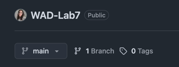

## Lab 7 Requirements

### 1. Run Backend Tests in the CI Pipeline
Configure the GitHub Actions pipeline to execute all backend tests automatically on every push or pull request.

### 2. Configure GitHub Secrets for Environment Variable Testing
The environment-related test in `Lab7Test.java` depends on the `MY_SECRET_KEY` environment variable, so it must be provided through GitHub Secrets.

Steps to configure it:

1. In your GitHub repository, navigate to **Settings > Secrets and variables > Actions**.
2. Create a new **repository secret** with the following details:
    - **Name:** `MY_SECRET_KEY`
    - **Value:** `ABC`
3. Update the pipeline configuration to expose this secret as an environment variable when running the tests.

**Important:** 
- Make sure the test is active by removing the `@Disabled` annotation from the `environment()` test.
- It's fine if the test fails on your local machine since you did not set the environment variable. 

### 3. Generate JaCoCo Coverage Report in the Pipeline
JaCoCo is already set up in `build.gradle` for generating code coverage reports.  
Extend the pipeline so that the JaCoCo report task is executed as part of the CI workflow.
### 4. Trigger the Pipeline only for Specific Branches
The workflow should be triggered only when pushing on a specific branch (for example, `test`).

How to create a new branch on GitHub & how to switch to it locally:
1. Create a new branch on GitHub by clicking on 1 Branch, then click on New branch and give it a suitable name.

2. In your local repository, switch to the new branch by running `git checkout branch-name`. Replace `branch-name` with the name of the branch you created.

**You can check the branch you are currently on by running `git branch`.** 

